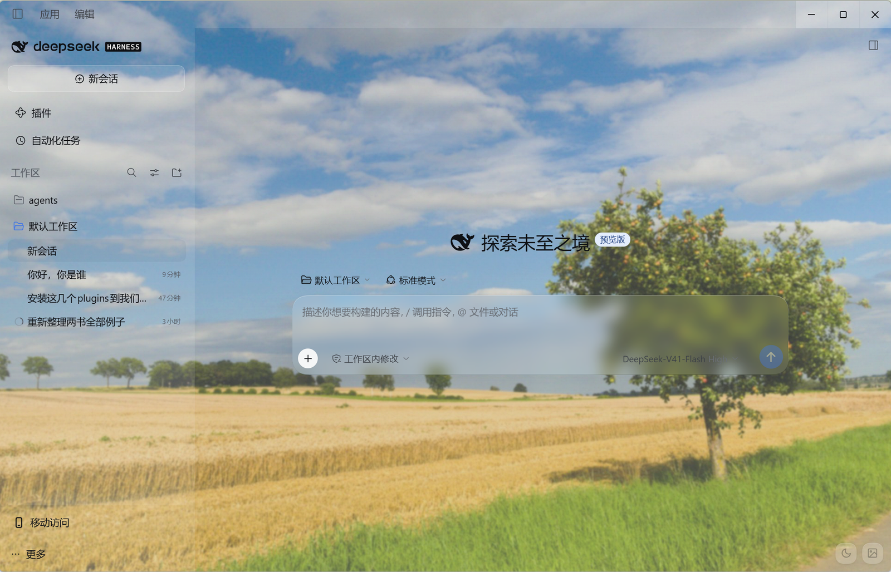
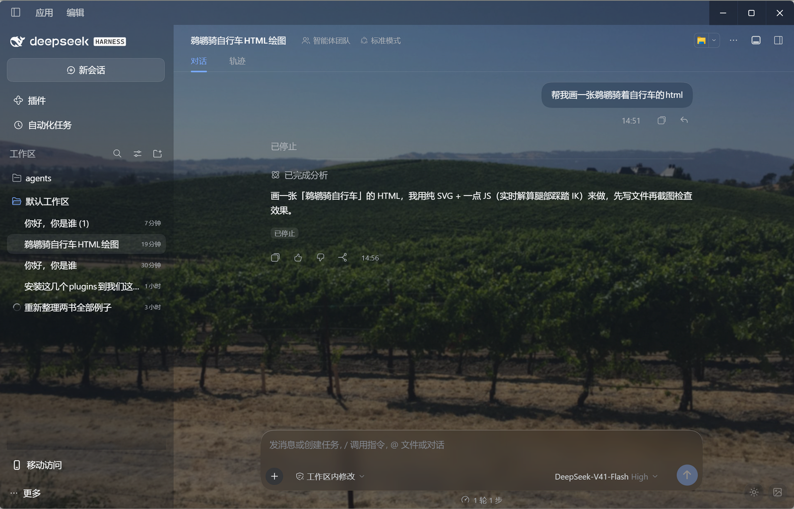

# Bliss Glass

**Where XP nostalgia meets liquid glass. / 当 XP 的怀旧风景，遇见现代的液态玻璃。**

[English](#english) · [中文](#中文)

---

## English

A [DeepSeek Harness](https://github.com/deepseek-ai/deepseek-harness) theme built on a simple contrast: the sun-lit, natural scenery wallpapers of the Windows XP era as the desktop backdrop — and every panel of the web UI rendered as modern frosted glass on top of it.

The two halves are deliberate. The wallpaper keeps its colors and calm; the interface becomes translucent, blurred glass — composer, menus, dialogs, bubbles, sidebars — each with a white hairline and a specular highlight, following your light and dark themes. It reads equally well on the desktop surface and on the mobile web UI.



### What it does

- **Scenery backdrop** — a fixed background wallpaper layer behind the whole web surface, with a subtle theme-aware veil so text stays readable.
- **Frosted-glass panels** — chat composer, menus, dialogs, bubbles, sidebars and toasts get translucent glass styling (blurred backdrop, white hairline border, specular top highlight), applied through DSH theme tokens so it follows light/dark automatically.
- **Wallpaper picker** — a small glass menu in the corner: choose from the bundled wallpapers (the original Bliss hill, Sonoma Valley, a wheat field, Tongo hills), import **any image** from disk or your phone's gallery (auto-downscaled and recompressed in the browser), or switch to a glass-only mode with no wallpaper.
- **Light / dark toggle** — a sun/moon button that switches the harness theme through the official theme service, so the preference is persisted.
- **Desktop & mobile** — the styling lives in CSS and renders in any Chromium-based browser; the picker, the toggle and the backdrop all work on the mobile web UI as-is.
- **Everything persists** — wallpaper choice, imported images and theme preference survive restarts.

### How it works (for reviewers)

The client module renders a fixed background layer and applies the frosted styling through DSH **theme tokens** (`--dsw-alias-bg-layer-*`, `--dsw-specific-*`) plus a small set of element rules matched against this build's panel classes (`RlGAzG_card`, `Xt1eiG_panel`, …). The wallpaper picker downscales and re-encodes imported images with a canvas in the browser; imported images are stored in `localStorage`. No host files are modified and no data leaves the machine.

> Panel class hooks are matched against DeepSeek Harness `0.2.0-rc.x`. On other builds the wallpaper and token layer keep working; the hashed-class refinements may need a selector update.

### Install

```sh
dsh plugin add github:YOUR_USERNAME/dsh-bliss-glass
```

or install it from the [dsh-market](https://github.com/dsh-market/dsh-market) **Themes** tab.

### Uninstall

Remove the plugin from the Plugin Manager, or:

```sh
dsh plugin --profile your-profile remove dsh-bliss-glass
```

## 中文

一个 [DeepSeek Harness](https://github.com/deepseek-ai/deepseek-harness) 主题插件，建立在一场刻意的相遇之上：Windows XP 年代阳光下的自然风光做桌面底色，Web 界面的每一块面板在其上化作现代的磨砂玻璃。

两半各有坚持。壁纸保留它的色彩与安宁；界面化为半透明、带背景模糊的玻璃——聊天框、菜单、对话框、气泡、侧栏，每一块都有白色细描边与一道顶部高光，跟随你的明暗主题。在桌面上，在手机的浏览器里，观感一致。



### 功能

- **风景底色**：整个 Web 界面之下的固定壁纸层，带随主题变化的轻柔蒙版，保证文字可读。
- **磨砂玻璃面板**：聊天输入框、菜单、对话框、气泡、侧栏与 Toast 均为半透明玻璃质感（背景模糊 + 白色描边 + 顶部高光），全部通过 DSH 主题 token 应用，自动跟随明暗模式。
- **壁纸选择器**：角落的小玻璃菜单——内置四张壁纸（Bliss 山丘、索诺玛山谷、麦田、通戈山丘），也可**导入任意图片**（本地图库或手机相册，浏览器内自动缩放、重新压缩），或切换到无壁纸的「纯玻璃」模式。
- **明暗切换**：太阳 / 月亮按钮，通过官方主题服务切换并持久保存偏好。
- **桌面与移动端**：样式全部由 CSS 实现，任何 Chromium 内核浏览器均可渲染；选择器、切换按钮与背景在移动版 Web 界面上开箱即用。
- **全部持久化**：壁纸选择、导入的图片与主题偏好在重启后保持。

### 实现方式（供评审参考）

Client 模块渲染一层固定背景，并通过 DSH **主题 token**（`--dsw-alias-bg-layer-*`、`--dsw-specific-*`）与少量按当前构建面板类名匹配的元素规则（`RlGAzG_card`、`Xt1eiG_panel` 等）应用磨砂样式。壁纸切换器在浏览器内用 canvas 对导入图片降采样并重新编码；导入的图片存于 `localStorage`。不修改任何宿主文件，数据不出本机。

> 面板类名钩子按 DeepSeek Harness `0.2.0-rc.x` 匹配。其他构建上壁纸与 token 层照常工作；哈希类名相关的细化样式可能需要更新选择器。

### 安装

```sh
dsh plugin add github:YOUR_USERNAME/dsh-bliss-glass
```

或在 [dsh-market](https://github.com/dsh-market/dsh-market) 的**主题**分类中安装。

### 卸载

在插件管理器中移除，或：

```sh
dsh plugin --profile your-profile remove dsh-bliss-glass
```

## License / 许可证

[MIT](LICENSE)
