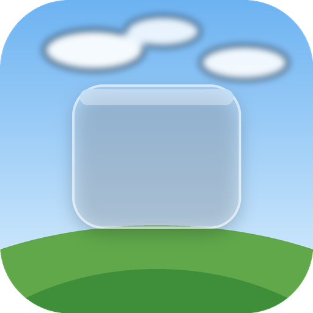
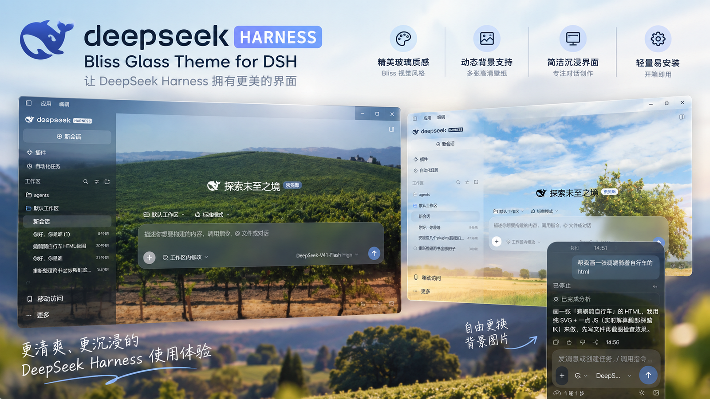
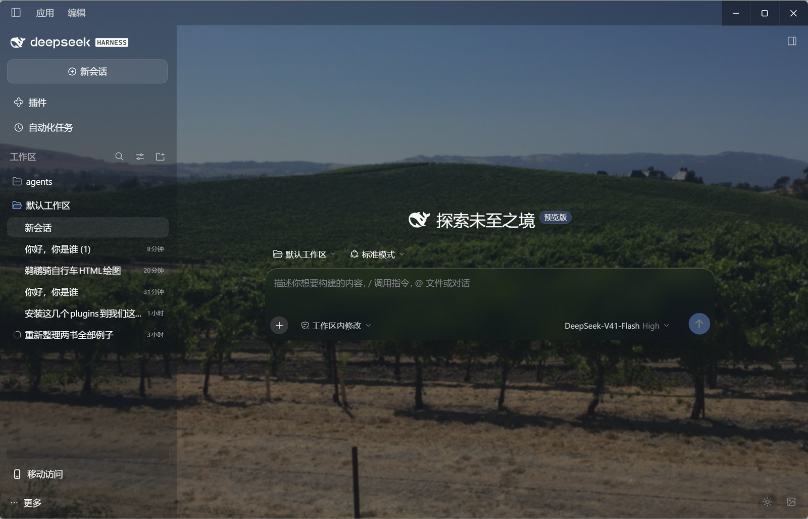
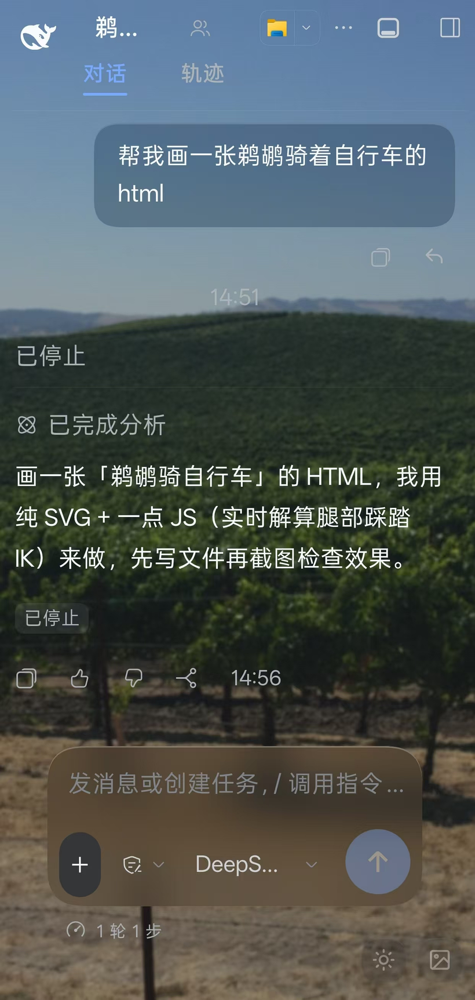

<div align="center">
  
  <h1>Bliss Glass</h1>
  <p><b>Theme for DeepSeek Harness · DeepSeek Harness 主题</b></p>
  <p><i>Where XP nostalgia meets liquid glass.<br/>当 XP 的怀旧风景，遇见现代的液态玻璃。</i></p>
  <p>
    <a href="#中文">简体中文</a> · <a href="#english">English</a>
  </p>
  <p>
    <a href="https://github.com/ahian-lee/dsh-bliss-glass/releases/latest"></a>
    <a href="LICENSE"></a>
    <a href="https://github.com/dsh-market/dsh-market"></a>
    
  </p>
  
</div>

---

## English

A [DeepSeek Harness](https://github.com/deepseek-ai/deepseek-harness) theme built on a simple contrast: the sun-lit, natural scenery wallpapers of the Windows XP era as the desktop backdrop — and every panel of the web UI rendered as modern frosted glass on top of it.

The two halves are deliberate. The wallpaper keeps its colors and calm; the interface becomes translucent, blurred glass — composer, menus, dialogs, bubbles, sidebars — each with a white hairline and a specular highlight, following your light and dark themes. It reads equally well on the desktop surface and on the mobile web UI.

### ✨ Features

|  | English | 中文 |
|---|---|---|
| 🧊 | **Frosted-glass panels** — composer, menus, dialogs, bubbles, sidebars, toasts; blurred backdrop, white hairline, specular highlight | **精美玻璃质感** — 聊天框、菜单、对话框、气泡、侧栏全覆盖 |
| 🖼 | **Dynamic wallpapers** — four bundled sceneries, plus import any image (auto-downscaled & recompressed in-browser) | **动态背景支持** — 内置四张风景，任意图片自动处理后即插即用 |
| 🌗 | **Light / dark toggle** — switches through the official theme service; preference persisted | **明暗一键切换** — 官方主题服务，偏好持久化 |
| 📱 | **Desktop & mobile** — pure CSS; works on the mobile web UI out of the box | **桌面与移动端** — 纯 CSS 实现，开箱即用 |
| 🪶 | **Light & easy** — no build step, no dependencies, no host files touched | **轻量易安装** — 无构建、零依赖、不改宿主文件 |

### 📸 Screenshots

| Light | Dark |
|---|---|
|  |  |

| Night (Bliss hill) | Mobile |
|---|---|
|  |  |

### 📦 Install

**Desktop app (recommended)** — open **Plugins → Add plugin**, paste the repository URL below, and confirm. No profile needs to be chosen; the app targets its own profile for you.

```
https://github.com/ahian-lee/dsh-bliss-glass
```

**Desktop, from the command line** — use the `dsh` that ships with the desktop app. `--profile` is required and must come **before** the pnpm arguments:

```sh
dsh plugin --profile desktop add github:ahian-lee/dsh-bliss-glass
```

**Web / other profiles** — same command with the profile you boot:

```sh
dsh plugin --profile web add github:ahian-lee/dsh-bliss-glass
```

> Running the desktop app? Quit it completely before installing from the command line — the `desktop` profile belongs to the app, and the app rewrites it on exit.

**dsh-market** — or one click from the [dsh-market](https://github.com/dsh-market/dsh-market) **Themes** tab.

### 🧭 Wallpaper picker

Click the small glass button in the bottom-right corner: a menu opens with thumbnails of every wallpaper — pick one, import any image from disk or your phone's gallery, switch to a glass-only mode, or turn the wallpaper off entirely. Your choice, imported images and theme preference all persist across restarts.

### 🔍 How it works (for reviewers)

The client module renders a fixed background layer and applies the frosted styling through DSH **theme tokens** (`--dsw-alias-bg-layer-*`, `--dsw-specific-*`) plus a small set of element rules matched against this build's panel classes (`RlGAzG_card`, `Xt1eiG_panel`, …). The wallpaper picker downscales and re-encodes imported images with a canvas in the browser; imported images are stored in `localStorage`. No host files are modified and no data leaves the machine.

> Panel class hooks are matched against DeepSeek Harness `0.2.0-rc.x`. On other builds the wallpaper and token layer keep working; the hashed-class refinements may need a selector update.

### 🗑 Uninstall

Remove the plugin from the Plugin Manager, or (quit the app first):

```sh
dsh plugin --profile desktop remove dsh-bliss-glass
```

---

## 中文

一个 [DeepSeek Harness](https://github.com/deepseek-ai/deepseek-harness) 主题插件，建立在一场刻意的相遇之上：Windows XP 年代阳光下的自然风光做桌面底色，Web 界面的每一块面板在其上化作现代的磨砂玻璃。

两半各有坚持。壁纸保留它的色彩与安宁；界面化为半透明、带背景模糊的玻璃——聊天框、菜单、对话框、气泡、侧栏，每一块都有白色细描边与一道顶部高光，跟随你的明暗主题。在桌面上，在手机的浏览器里，观感一致。

### ✨ 特色

|  | 功能 | 说明 |
|---|---|---|
| 🧊 | **精美玻璃质感** | 聊天框、菜单、对话框、气泡、侧栏、Toast 全覆盖：背景模糊 + 白描边 + 顶部高光 |
| 🖼 | **动态背景支持** | 内置四张高清风景；任意图片自动缩放压缩后即插即用 |
| 🌗 | **明暗一键切换** | 走官方主题服务，偏好持久化 |
| 📱 | **桌面与移动端** | 纯 CSS 实现，移动版 Web 界面开箱即用 |
| 🪶 | **轻量易安装** | 无构建、零依赖、不改宿主文件 |

### 📸 截图

| 浅色 | 深色 |
|---|---|
|  |  |

| 夜色（Bliss 山丘） | 移动端 |
|---|---|
|  |  |

### 📦 安装

**桌面应用（推荐）**——打开应用内 **插件 → 添加插件**，粘贴下面的仓库地址并确认。不需要选择 profile，应用会自动对接到自己的配置。

```
https://github.com/ahian-lee/dsh-bliss-glass
```

**桌面端命令行**——使用桌面版自带的 `dsh`。`--profile` 是必填项，且必须写在 pnpm 参数**之前**：

```sh
dsh plugin --profile desktop add github:ahian-lee/dsh-bliss-glass
```

**Web / 其他配置**——换成你实际启动的 profile 名称即可：

```sh
dsh plugin --profile web add github:ahian-lee/dsh-bliss-glass
```

> 若正在运行桌面应用，命令行安装前请先**完全退出应用**——`desktop` 配置由应用本身管理，退出时会被应用改写。

**dsh-market**——或在 [dsh-market](https://github.com/dsh-market/dsh-market) 的**主题**分类中一键安装。

### 🧭 壁纸切换器

点击右下角的小玻璃按钮：弹出缩略图菜单——选一张内置壁纸、导入任意本地图片或手机相册图片、切到无壁纸的「纯玻璃」模式，或干脆关掉壁纸。你的选择、导入的图片与主题偏好重启后都在。

### 🔍 实现方式（供评审参考）

Client 模块渲染一层固定背景，并通过 DSH **主题 token**（`--dsw-alias-bg-layer-*`、`--dsw-specific-*`）与少量按当前构建面板类名匹配的元素规则（`RlGAzG_card`、`Xt1eiG_panel` 等）应用磨砂样式。壁纸切换器在浏览器内用 canvas 对导入图片降采样并重新编码；导入的图片存于 `localStorage`。不修改任何宿主文件，数据不出本机。

> 面板类名钩子按 DeepSeek Harness `0.2.0-rc.x` 匹配。其他构建上壁纸与 token 层照常工作；哈希类名相关的细化样式可能需要更新选择器。

### 🗑 卸载

在插件管理器中移除，或（先退出应用）：

```sh
dsh plugin --profile desktop remove dsh-bliss-glass
```

---

<div align="center">
  <i>The wallpaper keeps its calm; the interface keeps its clarity.<br/>壁纸守住它的安宁，界面守住它的清透。</i>
</div>

## License / 许可证

[MIT](LICENSE)
